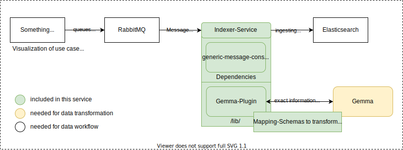

# Indexing-service


[](https://coveralls.io/github/kit-data-manager/indexing-service?branch=master)


:warning:
Not fully tested yet!
For mapping documents only Gemma is available currently!

A standalone service which receives messages about changes in metadata documents maps them to a common format and ingests them into elasticsearch.




## How to build

Dependencies that are needed to build and are not being downloaded via gradle:

- OpenJDK 11

`./gradlew -Pclean-release build`

## How to start

> TODO This section is a placeholder. It still needs to be written properly.

### Prerequisites

You might want to take a look at testbed4inf, which should make it easy to satisfy those.

- Gemma?
- a RabbitMQ instance
- an elasticsearch instance

### Setup using Docker
#### Install Gemma
```
sudo apt-get install --assume-yes python3 python3-pip 
pip3 install xmltodict wget
```

#### Install and Start Network
```
docker network create network4datamanager
```

#### Install and Start Elasticsearch
```
docker pull elasticsearch:7.9.3
docker run -d --name elasticsearch4metastore  -p 9200:9200 -p 9300:9300 -e "discovery.type=single-node" elasticsearch:7.9.3
```

#### Install and Start RabbitMQ
```
docker run -d --hostname rabbitmq --net network4datamanager --name rabbitmq4docker -p 5672:5672 -p 15672:15672 rabbitmq:3-management
```
#### Managing Services
To start/stop a single service just type
```
docker start/stop name_of_container
```
e.g.:
```
docker stop elasticsearch4metastore
```


## More information

## License

See [LICENSE file in this repository](LICENSE).